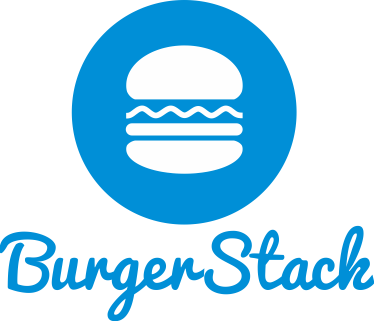

# BurgerStack ...WIP...

## All cool staffs in one stack

A full stack framework, with template pages and E2E sample functionalities.

Why BurgerStack?

It's a full stack, easy to use, modern web framework. Just pick it up and use it. As simple as pickup a Hamburger and eat it.

## Features

* Angular 2
* TypeScript
* Node/Express
* Redis
* MongoDB with Mongoose
* PostgreSQL with Sequlize
* Webpack
* Bootstrap 4
* ...

## Still heavily WIP

## Current Status

* Configured express
* Connected with MongoDB/PostgreSQL/Redis
* Mocha/Karma works
* Webpack works

## Next Plan

* Angular2 Template Pages with Bootstrap4
* Some E2E features showing how this full stack works
* Documentation
